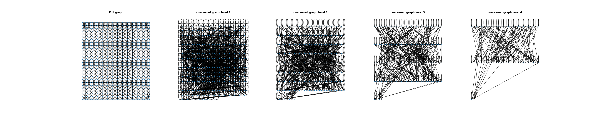
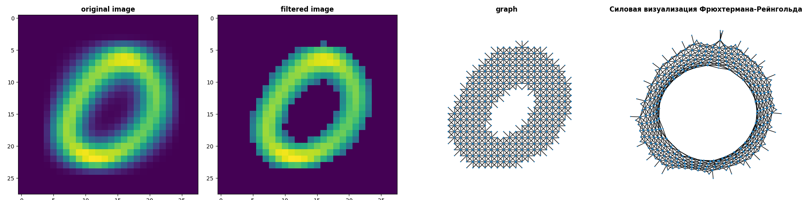
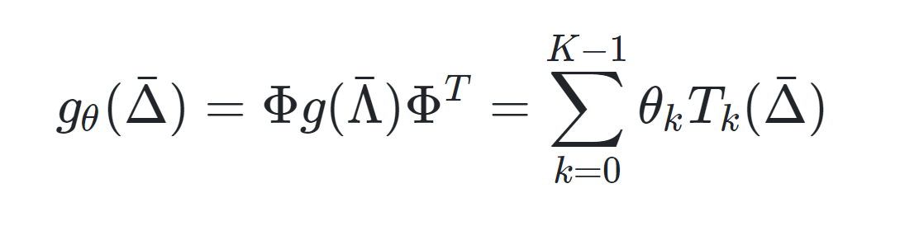

# Сверточная нейронная сеть на графах с быстрой локализованной спектральной фильтрацией на основе модели LeNet5

____

## Оглавление

0. [Введение](#Введение)
1. [Обработка данных. Формирование датасета](#Обработка-данных.Формирование-датасета)
2. [Модель графовой сверточной нейронной сети](#Модель-графовой-сверточной-нейронной-сети)
3. [Обучение нейронной сети](#Обучение-нейронной-сети)
4. [Результаты эксперимента на датасете MNIST](#Результаты-эксперимента-на-датасете-MNIST)
5. [Итоги](#Итоги)
6. [Ссылки](#Ссылки)

 ____
 
 ## Введение
 
Реализация графовой нейронной сети на библиотеке PyTorch представленной в статье от M. Defferrard, X. Bresson, and P. Vandergheynst, on “Convolutional Neural Networks on Graphs with Fast Localized Spectral Filtering”. [1](https://arxiv.org/abs/1606.09375)

Представленная графовая сверточная нейронная сеть построена на адаптированной под графы архитектуре LeNet5. [2](https://www.datasciencecentral.com/lenet-5-a-classic-cnn-architecture)

Сверточные нейронные сети располагают эффективной архитектурой для извлечения высокозначимых статистических закономерностей(паттернов). Эти закономерности определяются с помощью локализованных сверточных фильтров, которые обучаются на основе подаваемых в нейронную сеть данных.

Локальные графовые сверточные фильтры являются инвариантными к сдвигу данных, что означает, что они способны распознавать закономерности независимо от их пространственного положения.

*Рис.1. Архитектура сверточной нейронной сети на графовых данных.*
 
 ## Обработка данных. Формирование датасета
 
Для обучения графовой нейронной сети был выбран датасет MNIST. База данных MNIST — объёмная база данных образцов рукописного написания цифр. База данных является стандартом, предложенным Национальным институтом стандартов и технологий США с целью калибрации и сопоставления методов распознавания изображений с помощью машинного обучения в первую очередь на основе нейронных сетей [3](https://en.wikipedia.org/wiki/MNIST_database).

*Рис.2. Пример датасета MNIST*
 
Так как датасет MNIST состоит из изображений с разрешением 28x28 пикселей, то необходимо создать полносвязный граф размерностью 28x28=784 точек. Из полносвязного графа делаем 4 "огрубленных" графов для использования в более глубоких графовых сверточных слоях нейронной сети. Для каждого графа также вычисляем собственный вектор матрицы Кирхгофа для последующей нормализации графа в сверточных слоях. [4](https://www.youtube.com/watch?v=IdsV0RaC9jM)

 
*Рис.3. Визуализация процесса огрубления графа*

 
*Рис.4. Огрубление полносвязного графа*

 
*Рис.5. Огрубление полносвязного графа представленное в виде силовой визуализации Фрюхтермана-Рейнгольда* [5](http://pco.iis.nsk.su/wega/index.php/%D0%90%D0%BB%D0%B3%D0%BE%D1%80%D0%B8%D1%82%D0%BC_%D0%A4%D1%80%D1%8E%D1%85%D1%82%D0%B5%D1%80%D0%BC%D0%B0%D0%BD%D0%B0-%D0%A0%D0%B5%D0%B9%D0%BD%D0%B3%D0%BE%D0%BB%D1%8C%D0%B4%D0%B0)

Граф можно предварительно обработать перед подачей в нейросеть, к примеру "обрезать" его или изменить количество связей между точками графа, из этого следует что можно делать перебор графов для достижения более лучших результатов обучения. Данная концепция обработки графов называется "Graph feature". В качестве примера можно "обрезать" граф перед подачей в нейросеть, возьмем какое-либо изображение из датасета и обрежем граф по этому изображению, тем самым сформировав "Graph feature".

 
*Рис.6. Формирование Graph feature*

После огрубления графа мы получили список индексов для переупорядочивания матриц смежности и данных изображения таким образом, чтобы объединение двух соседей от слоя к слою образовывало бинарное дерево. С полученными индексами реиндексируем датасет MNIST. Индексов может получаться больше чем данных в изображении (928>784) из-за синглтонов в графах, данные индексы мы заполняем пустыми векторами(0) для того, чтобы графовый слой maxpooling эти данные игнорировала.

После обработки данных мы объявляем модель нейронной графовой сверточной сети и подаем полученные данные на вход.

 
*Рис.7. Блок-схема обработки данных*

## Модель графовой сверточной нейронной сети

Для классификации датасета MNIST использовалась и модернизировалась сверточная нейросеть LeNet5. [2](https://www.datasciencecentral.com/lenet-5-a-classic-cnn-architecture)

Из особенностей модернизации LeNet5 можно отметить замену обычных сверточных слоев на графовые сверточные слои и наличие l2 regularization в функции ошибки, чтобы предотвратить переобучение нейросети. [6](https://towardsdatascience.com/intuitions-on-l1-and-l2-regularisation-235f2db4c261)

Графовый сверточный слой основан на быстрой локализованной спектральной фильтрацией по полиному Чебышева. Слой принимает в себя преобразованные данные датасета, огрубленный или полносвязный граф и собственный вектор матрицы Кирхгофа. Используя вектор граф скалируется по Лапласу [-1; 1]. Далее граф с данными "свертывается" спектральной фильтрацией по полиному Чебышева. Полученный массив с данными сверток подается на слой нейронов Dense.

 
*Рис.8. Формула полинома Чебышева*

 
*Рис.9. Визуализация свертки*

Графовая операция подвыборки (Graph max-pooling). В случае изображений операция объединения состоит в том, что берется участок пикселей фиксированного размера, скажем 2x2, и сохраняется только пиксель с максимальным значением, а остальные пиксели из участка отбрасываются. Аналогичная концепция объединения может быть применена к графам. В статье по которому реализована графовая сеть операция maxpooling представлена в виде многоуровневого алгоритма кластеризации "Graclus". "Жадное" правило алгоритма Graclus состоит в том, что на каждом уровне огрубления выбирается немаркированная вершина i и сопоставляется с одной из ее немаркированных соседей j, которая максимизирует локальный нормализованный срез Wij(1/di+1/dj). Затем две совпавшие вершины помечаются, и на их веса устанавливается сумма весов соседей. Операция повторяется до тех пор, пока не будут исследованы все вершины. Это очень быстрая схема огрубления графа, которая делит количество узлов примерно на 2. После огрубления узлы графа перестраиваются в сбалансированное двоичное дерево. На следующем рисунке показан пример огрубления и обьединения графа: 

 
*Рис.10. Graph max-pooling методом Graclus*

 
*Рис.11. Визуализация Graph max-pooling*

Полная визуализация адаптированной архитектуры нейросети LeNet5:
  
 
*Рис.12. Визуализация модели*

## Результаты эксперимента на датасете MNIST

Построенная нейросеть очень быстро обучается и находит паттерны/закономерности в датасете MNIST и показывает точность 99.140%. Несмотря на простую и самую старую архитектуру LeNet5 данная модель показывает высокую точность. На момент написания нейросети модель входит в топ 18 по точности классификации изображений на датасете MNIST [7](https://paperswithcode.com/sota/image-classification-on-mnist?metric=Accuracy)

*Рис.13. График обучения*

## Ссылки

1. [Convolutional Neural Networks on Graphs with Fast Localized Spectral Filtering](https://arxiv.org/abs/1606.09375)
2. [LeNet-5. A Classic CNN Architecture](https://www.datasciencecentral.com/lenet-5-a-classic-cnn-architecture/)
3. [MNIST database](https://en.wikipedia.org/wiki/MNIST_database)
4. [Finding Eigenvalues and Eigenvectors : 2 x 2 Matrix Example](https://www.youtube.com/watch?v=IdsV0RaC9jM)
5. [Алгоритм Фрюхтермана-Рейнгольда](http://pco.iis.nsk.su/wega/index.php/%D0%90%D0%BB%D0%B3%D0%BE%D1%80%D0%B8%D1%82%D0%BC_%D0%A4%D1%80%D1%8E%D1%85%D1%82%D0%B5%D1%80%D0%BC%D0%B0%D0%BD%D0%B0-%D0%A0%D0%B5%D0%B9%D0%BD%D0%B3%D0%BE%D0%BB%D1%8C%D0%B4%D0%B0)
6. [Intuitions on L1 and L2 Regularisation](https://towardsdatascience.com/intuitions-on-l1-and-l2-regularisation-235f2db4c261)
7. [Benchmark Image Classification on MNIST](https://paperswithcode.com/sota/image-classification-on-mnist?metric=Accuracy)
